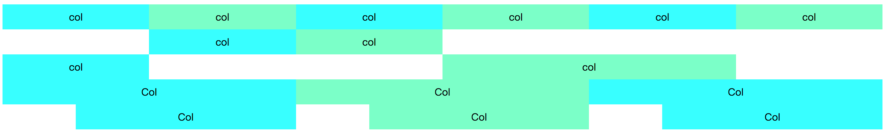

# simple-grid

> a simple grid layout

      <Row class="demo">
      <Col :span="4" class="demo-col">col</Col>
      <Col :span="4" class="demo-col">col</Col>
      <Col :span="4" class="demo-col">col</Col>
      <Col :span="4" class="demo-col">col</Col>
      <Col :span="4" class="demo-col">col</Col>
      <Col :span="4" class="demo-col">col</Col>
    </Row>

    <Row class="demo">
      <Col :span="4" :offset="4" class="demo-col">col</Col>
      <Col :span="4" class="demo-col">col</Col>
    </Row>
    <Row class="demo">
      <Col :span="4"  class="demo-col">col</Col>
      <Col :span="8" :offset="4" :push="4" class="demo-col">col</Col>
    </Row>

    <Row class="demo">
      <Col :xs="2" :sm="4" :md="6" :lg="8" class="demo-col">Col</Col>
      <Col :xs="20" :sm="16" :md="12" :lg="8" class="demo-col">Col</Col>
      <Col :xs="2" :sm="4" :md="6" :lg="8" class="demo-col">Col</Col>
    </Row>

    <Row>
      <Col :xs="{ span: 5, offset: 1 }" :lg="{ span: 6, offset: 2 }" class="demo-col">Col</Col>
      <Col :xs="{ span: 11, offset: 1 }" :lg="{ span: 6, offset: 2 }" class="demo-col">Col</Col>
      <Col :xs="{ span: 5, offset: 1 }" :lg="{ span: 6, offset: 2 }" class="demo-col">Col</Col>
    </Row>

